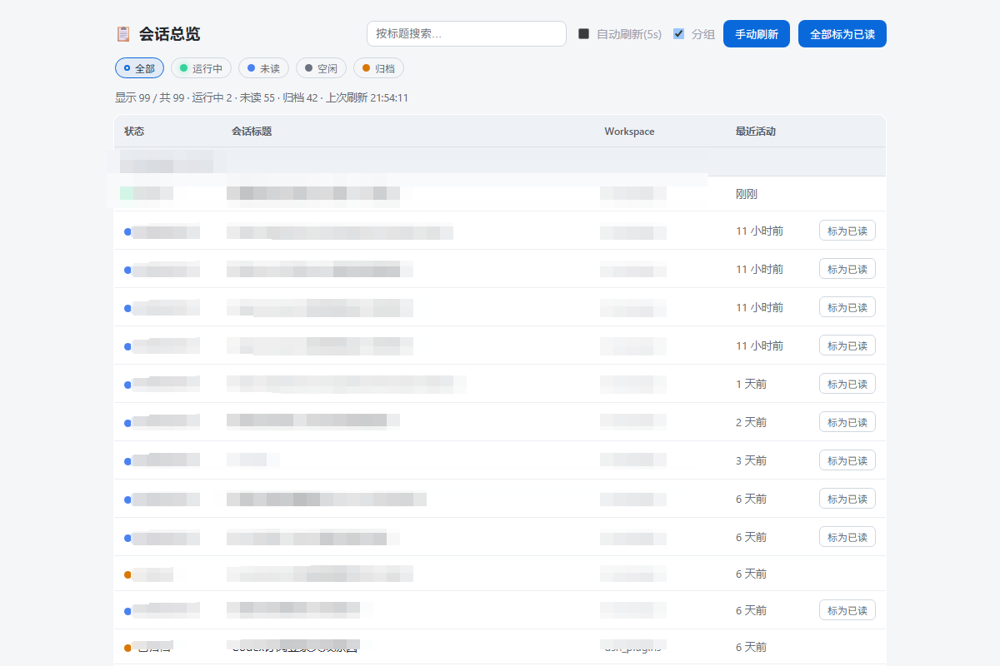

# dsh-session-overview

[](./LICENSE)

<p align="center">
  
</p>

DSH（DeepSeek Harness）**会话总览面板插件** —— 纯 JavaScript 免构建，运行时注入即生效。

工作区头部行旁多一颗「会话总览」图标按钮（内联 SVG 线性图标，随主题变色，与搜索/视图选项/添加工作区那排对齐），点开悬浮面板即可总览**全部会话**：

- **四态徽章**：🟢 运行中（脉动） / 🔵 新完结·未读 / ⚪ 空闲 / 📦 已归档
- **工作区分组**：按 workspace 分节展示（可切平铺），「未分组」固定末位
- **状态筛选**：「全部」+ 四个带色点状态 chip，单选互斥，再点恢复全量
- **点击行直接跳转**：主界面自动切换到该会话（成功后自动标为已读）
- **未读记账**：本地 localStorage 账本，行级「标为已读」+ 一键「全部标为已读」，刷新不丢
- 标题搜索、自动刷新开关（默认关，偏好记忆）、手动刷新、中文界面、深浅色主题适配

## 安装

### 方式一：GitHub（推荐）

```bash
dshpm install github:mathhyphen/dsh-session-overview
# 或
dsh plugin add github:mathhyphen/dsh-session-overview
```

安装后重启 dsh web 由 bundles 列表装配。

### 方式二：本地源码 + super-injector 运行时注入

```bash
git clone https://github.com/mathhyphen/dsh-session-overview.git
```

然后在 DSH 会话里调用注入器工具：

```text
dev_inject_plugin <插件目录>        # 注入即生效（host + UI 双通道）
dev_reload_package dsh-session-overview   # 改代码后热重载
dev_uninject_plugin dsh-session-overview  # 卸载即净
```

注入成功判据：输出含 `host ✓` 与 `client ✓ (lib/client.js)` 两行；浏览器访问
`http://127.0.0.1:3080/dsh-session-overview` 应返回面板页。

## 接口

| 路由 | 说明 |
|---|---|
| `GET /dsh-session-overview` | 面板页（完整 HTML，中文界面） |
| `GET /dsh-session-overview/api/state` | 全部会话 JSON：`{ ok, ts, count, rows:[{ id, title, workspace, running, archived, lastActivity, attached, cwd }] }`，按最近活动新→旧排序 |

## 列表语义

- 归档会话**保留展示**（打 `archived=true` 标、琥珀徽章），不再隐藏
- 子代理/团队会话过滤：`origin === 'subagent'` 或 `delegationDepth > 0` 的会话不进总览（行结构仍带 `origin` 字段便于调试）
- blank 且非运行中的空会话过滤
- attached（`ctx.sessions.list()`）∪ cold（`ctx.get('sessionPersistence').list()`）按 id 去重
- 可选服务（sessionProjections / sessionPersistence / sessionProjectionCache / workspaceRegistry）缺失时自动判空降级，不炸面板
- 未读判定在浏览器本地：`unread = !running && !archived && lastActivity > seen[id]`；四态优先级 `running > archived > unread > idle`
- 统计行跟随当前筛选口径，总数以「显示 x / 共 N」注明

## 性能（t30）

- **服务端缓存**：插件内维护 rows 快照，`session/event` / `agent/status` 触发脏标记（≥500ms 防抖合并后台重算）；`/api/state` 常态直接返回缓存（毫秒级），脏时同步重算一次；超 10s 未重算自动后台自愈（防事件监听失效）
- **增量计算**：单会话行按 `(createdAt|lastEventAt|running|origin|depth|cwd)` 键复用，未变化的会话跳过投影快照重算；blank 廉价判定前置到投影之前
- **客户端秒开**：最近一次成功 rows 存 localStorage `dsh-so-cache`，打开面板先瞬时渲染缓存再后台取新数据（差异轻微淡入）
- **乐观已读**：行点击瞬间写已读账本并即时重渲染（蓝点点击即消）；跳转回执 `ok=false` 时自动回滚该条
- **观测**：URL 加 `?debug=1` 返回 `stats`（ms/hits/misses/fromCache/cached/ageMs）；localStorage `dsh-so-debug=1` 在控制台输出每次重算与桥事件日志

## 本地存储键

| 键 | 内容 |
|---|---|
| `dsh-so-seen` | 未读账本 `{ sessionId: lastAckTs }` |
| `dsh-so-grouped` | 分组/平铺偏好 |
| `dsh-so-autorefresh` | 自动刷新偏好（默认关） |
| `dsh-so-filters` | 状态筛选（`'all' \| 'running' \| 'unread' \| 'idle' \| 'archived'`） |
| `dsh-so-cache` | 秒开缓存（最近一次成功 rows 快照） |

## 结构

- `lib/index.js` — host 侧 cordis 插件（`name` / `inject:['webServer']` / `apply`）：前缀路由（面板页 + 数据 API），数据聚合与排序见 `NOTES-data.md`
- `lib/client.js` — 浏览器模块（手写 `__ModuleLoader__` CJS 外壳）：经 `shell.overlay` 槽（additive list/root，仅承载生命周期）把入口按钮做成**工作区头部行的行内原生 portal 子元素**——以「搜索会话/Search」前缀的侧边栏搜索输入框为**陆标**（i18n 双语，退回首个可见文本输入框、无陆标静默），行容器取陆标向上 ≤4 层首个含 ≥2 个 button 子元素的祖先（即图标按钮排，仍无则用 parentElement），`createPortal(button, hostEl)` 成为真实 flex 子元素、对齐交给行自身布局；自愈：document.body MutationObserver + 120ms 防抖 + needsReinsert(isConnected/contains) 失联即递增 portal key 强制重插，卸载清理 observer 与残留节点；localStorage `dsh-so-debug=1` 可查看每次探测几何；两参契约 `ctx.slots.register(options, Component)`（React Entry 管状态 + `createPortal` 悬浮层）；承载跳转桥——监听面板 iframe 的 `dsh-so:navigate` 消息（origin + type 双校验，**Entry 挂载即注册、不依赖面板开合**）→ `ctx.sessions.open(id)` → 回执先发、成功才收起面板并回执 `dsh-so:navigated`；localStorage `dsh-so-debug=1` 同时输出探测几何与跳转桥全链路事件（navigate-received / open-result / reply-sent / navigated-ok）
- `NOTES-*.md` — 开发期研究档案：插件契约 / 会话数据面 / slots 实证 / 跳转通道 / 注入验收清单，全部附宿主源码出处
- 无 src/scripts/tsconfig —— 兼容 npm 安装版 DSH（无 TS 构建管线），全部手写纯 JS

## 隐私

- 所有数据来自本机 DSH 宿主进程，仅本地展示，**无任何外部网络调用**
- 未读账本与偏好存于浏览器 localStorage，不上传

## License

BSD-3-Clause，详见 [LICENSE](./LICENSE)。
